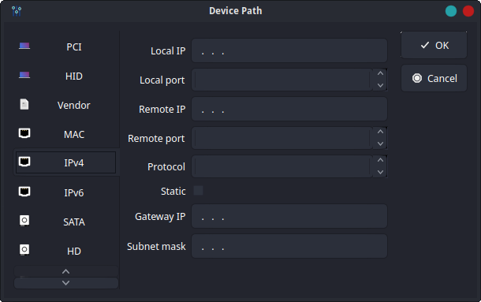

# EFI Boot Editor

Boot Editor for (U)EFI based systems.

## Requirements

* [Qt](//www.qt.io/) (>=5.15.2)
* [efivar](//github.com/rhboot/efivar) (>=37) on linux

## Installation

See [INSTALL](INSTALL.md) instructions.

## License

This project is licensed under the LGPLv3 License -
see the [LICENSE](LICENSE.txt) file for details
