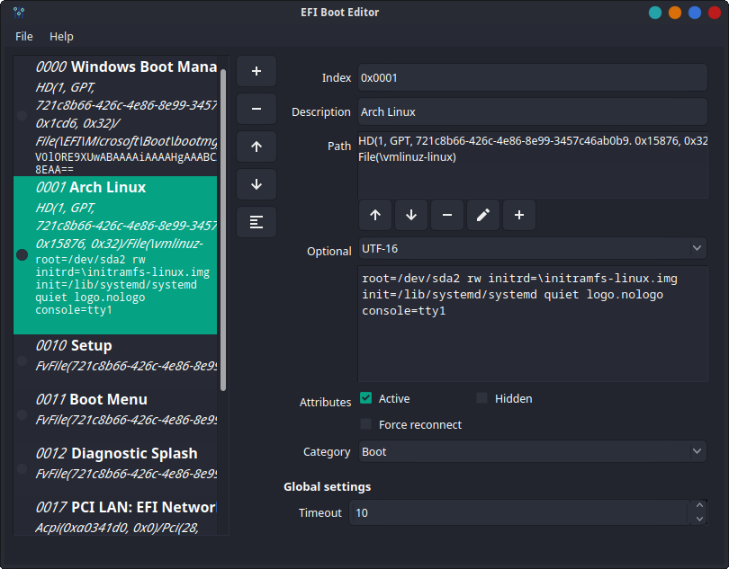

# EFI Boot Editor

Boot Editor for (U)EFI based systems.




## Command-line interface

There is also a command-line interface for quick backup/restore functionality:

```shell
Usage: efibooteditor [options]
Boot Editor for (U)EFI based systems.

Options:
  -h, --help           Displays help on commandline options.
  --help-all           Displays help including Qt specific options.
  -v, --version        Displays version information.
  -e, --export <FILE>  Export configuration.
  -d, --dump <FILE>    Dump raw EFI data.
  -i, --import <FILE>  Import configuration from JSON (either from export or
                       raw dump).
  -f, --force          Force import, don't ask for confirmation.
```

## Requirements

* [Qt](//www.qt.io/) (>=5.12)
* [efivar](//github.com/rhboot/efivar) (>=37) on linux

## Installation

See [INSTALL](INSTALL.md) instructions.

## Localization

You can help localize this project on [Weblate](https://hosted.weblate.org/engage/efibooteditor/).

## License

This project is licensed under the LGPLv3 License -
see the [LICENSE](LICENSE.txt) file for details
